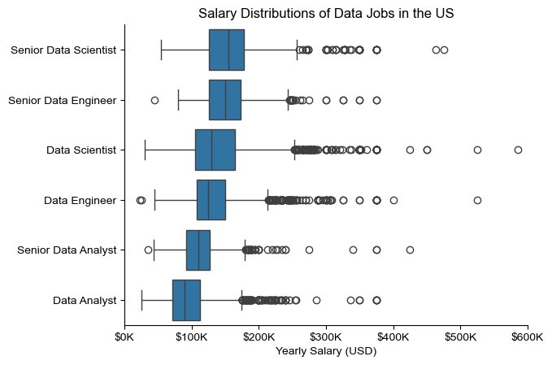

# Overview
This projects area of focus is with the Data job market, more specifically on Data Analyst positions. The reason why I started this project was to get a bigger picture and navigate throughout the job landscape. With the help of this project, I will be able to see what are the most valuable and the most in demand skills, while also being able to clearly identify the best opportunities for Data Analysts.

The data sourced from Luke Barousse's Python Course which provides a foundation for my analysis, containing detailed information on job titles, salaries, locations, and essential skills. I was able to solve key questions like what is the salary variance, what the connection between demand and pay in the data analytics field is, and what skills are the most needed and searched.
# Questions
There are four questions that I will answer with my project:
1. What are the skills most in demand for the top 3 most popular data roles?
2. How are in-demand skills trending for Data Analysts?
3. How well do jobs and skills pay for Data Analysts?
4. What are the optimal skills for data analysts to learn? (High Demand AND High Paying)
# Tools I Used 
To dive even more deeper into my study on the data analyst job market, I used a variety of tools to complete the analysis:
Python was the basis of my work, as it helped me examine the data and find crucial insights. With python, I also used a numerous amount of libraries:
    Pandas, which allowed me to analyze and organize data proficiently.
    Matplotlib, which gave me the ability to visualize the data.
    Seaborn, which helped me further improve the quality of the visuals.
Jupyter Notebooks: The tool I used to run my Python scripts which let me easily include my notes and analysis.
Visual Studio Code: My go-to for executing my Python scripts.
Git & GitHub: Essential for version control and sharing my Python code and analysis, ensuring collaboration and project tracking.
# Data Preparation and Cleanup
This section is primarily for showing the first steps taken when preparing for data analysis, which ensures accuracy and usability
## Import and Cleanup Data 
I start by importing necessary libraries and loading the dataset, followed by initial data cleaning tasks to ensure data quality.
```python
# Importing Libraries
import ast
import pandas as pd
import seaborn as sns
from datasets import load_dataset
import matplotlib.pyplot as plt  

# Loading Data
dataset = load_dataset('lukebarousse/data_jobs')
df = dataset['train'].to_pandas()

# Data Cleanup
df['job_posted_date'] = pd.to_datetime(df['job_posted_date'])
df['job_skills'] = df['job_skills'].apply(lambda x: ast.literal_eval(x) if pd.notna(x) else x)
```
# The Analysis

## 1. What are the most demanded skills for the top 3 most popular data roles?
To find the most demanded skills for the top 3 most popular data roles, I filtered out those positions by which ones were the most popular, and got the top 5 skills for these top 3 roles. This query highlights the most popular job titles and their top skills, showing which skills I should pay attention to depending on the role I'm targeting.

## 2. How are in-demand skills trending for Data Analysts?
    ```py
from matplotlib.ticker import PercentFormatter
import matplotlib.pyplot as plt
import seaborn as sns

df_plot = df_DA_US_percent.iloc[:, :5]
sns.set_theme(style='ticks')
sns.lineplot(data=df_plot, dashes=False, legend='full', palette='tab10')
sns.despine()  # remove top and right spines

plt.title('Trending Top Skills for Data Analysts in the US')
plt.ylabel('Likelihood in Job Posting')
plt.xlabel('2023')
plt.legend().remove()
plt.gca().yaxis.set_major_formatter(PercentFormatter(decimals=0))

for i in range(5):
    plt.text(11.2, df_plot.iloc[-1, i], df_plot.columns[i], color='black')
    ```
# Result


*Bar graph visuallizing the trending top skills for data analysts in the US in 2023*
### Insights:
SQL remains the most consistently demanded skill throughout the year, although it shows a gradual decrease in demand. Excel experienced a significant increase in demand starting around September, surpassing both Python and Tableau by the end of the year.
Both Python and Tableau show relatively stable demand throughout the year with some fluctuations but remain essential skills for data analysts. Power BI, while less demanded compared to the others, shows a slight upward trend towards the year's end.
## 3. How well do jobs and skills pay for Data Analysts?
To identify the highest-paying roles and skills, I only got jobs in the United States and looked at their median salary. But first I looked at the salary distributions of common data jobs like Data Scientist, Data Engineer, and Data Analyst, to get an idea of which jobs are paid the most.
    ```python
    sns.boxplot(data=df_US_top6, x='salary_year_avg', y='job_title_short', order=job_order)

    ticks_x = plt.FuncFormatter(lambda y, pos: f'${int(y/1000)}K')
    plt.gca().xaxis.set_major_formatter(ticks_x)
    plt.show()
    ```

### Insights:
There's a significant variation in salary ranges across different job titles. Senior Data Scientist positions tend to have the highest salary potential, with up to $600K, indicating the high value placed on advanced data skills and experience in the industry.

Senior Data Engineer and Senior Data Scientist roles show a considerable number of outliers on the higher end of the salary spectrum, suggesting that exceptional skills or circumstances can lead to high pay in these roles. In contrast, Data Analyst roles demonstrate more consistency in salary, with fewer outliers.

The median salaries increase with the seniority and specialization of the roles. Senior roles (Senior Data Scientist, Senior Data Engineer) not only have higher median salaries but also larger differences in typical salaries, reflecting greater variance in compensation as responsibilities increase.

Next, a subplot was created to determine and compare the highest paid and most indemand skills for Data Analysts in the US.

    ```python
fig, ax = plt.subplots(2, 1)  

# Top 10 Highest Paid Skills for Data Analysts
sns.barplot(data=df_DA_top_pay, x='median', y=df_DA_top_pay.index, hue='median', ax=ax[0], palette='dark:b_r')
ax[0].legend().remove()
# original code:
# df_DA_top_pay[::-1].plot(kind='barh', y='median', ax=ax[0], legend=False) 
ax[0].set_title('Highest Paid Skills for Data Analysts in the US')
ax[0].set_ylabel('')
ax[0].set_xlabel('')
ax[0].xaxis.set_major_formatter(plt.FuncFormatter(lambda x, _: f'${int(x/1000)}K'))


# Top 10 Most In-Demand Skills for Data Analysts')
sns.barplot(data=df_DA_skills, x='median', y=df_DA_skills.index, hue='median', ax=ax[1], palette='light:b')
ax[1].legend().remove()
# original code:
# df_DA_skills[::-1].plot(kind='barh', y='median', ax=ax[1], legend=False)
ax[1].set_title('Most In-Demand Skills for Data Analysts in the US')
ax[1].set_ylabel('')
ax[1].set_xlabel('Median Salary (USD)')
ax[1].set_xlim(ax[0].get_xlim())  # Set the same x-axis limits as the first plot
ax[1].xaxis.set_major_formatter(plt.FuncFormatter(lambda x, _: f'${int(x/1000)}K'))

sns.set_theme(style='ticks')
plt.tight_layout()
plt.show()
    ```


*Two separate bar graphs visualizing the highest paid skills and most in-demand skills for data analysts in the US.*
## 4. What is the most optimal skill to learn for Data Analysts?
#### Visualize data

```python 
from adjustText import adjust_text
import matplotlib.pyplot as plt

plt.scatter(df_DA_skills_high_demand['skill_percent'], df_DA_skills_high_demand['median_salary'])
plt.show()
```
#### Results 


*A scatter plot visualizing the most optimal skills (high paying & high demand) for data analysts in the US.*

#### Insights:
The skill Oracle appears to have the highest median salary of nearly $97K, despite being less common in job postings. This suggests a high value placed on specialized database skills within the data analyst profession.

More commonly required skills like Excel and SQL have a large presence in job listings but lower median salaries compared to specialized skills like Python and Tableau, which not only have higher salaries but are also moderately prevalent in job listings.

Skills such as Python, Tableau, and SQL Server are towards the higher end of the salary spectrum while also being fairly common in job listings, indicating that proficiency in these tools can lead to good opportunities in data analytics.
# What I learned
I improved my technical proficiency in Python, particularly in data manipulation and visualization, and broadened my knowledge of the data analyst job market during this assignment. Here are some particular things I discovered:

Advanced Python Usage: I was able to complete difficult data analysis jobs more quickly by using libraries like Seaborn and Matplotlib for data visualization, Pandas for data manipulation, and others.
Data Cleaning Importance: I discovered that in order to ensure the correctness of the insights obtained from the data, extensive data preparation and cleaning are essential before any analysis can be carried out.

Strategic Skill Analysis: The project highlighted how crucial it is to match one's abilities with the demands of the market. More strategic career planning in the technology industry is made possible by an understanding of the relationship between skill demand, salary, and employment availability.
# Insights
This project provided several general insights into the data job market for analysts:

Skill Demand and Salary Correlation: There is a clear correlation between the demand for specific skills and the salaries these skills command. Advanced and specialized skills like Python and Oracle often lead to higher salaries.
Market Trends: There are changing trends in skill demand, highlighting the dynamic nature of the data job market. Keeping up with these trends is essential for career growth in data analytics.
Economic Value of Skills: Understanding which skills are both in-demand and well-compensated can guide data analysts in prioritizing learning to maximize their economic returns.
# Challenges I Faced
Each challenge that I faced in this project provided me a new learning opportunity to grow:
Inconsistent Data: To make my analysis reliable, I went through and fixed any missing and inconsistent entries.
Complex Data Visualization: It was a struggle to create clear and comprehensive data charts, but it allowed me to provide a detailed visual to convey ideas.
Balancing Breadth and Depth: Deciding how deeply to dive into each analysis while maintaining a broad overview of the data landscape required constant balancing to ensure comprehensive coverage without getting lost in details.
# Conclusion
This study on the employment market for data analysts has been extremely informative and has revealed the principal competencies and trends that define this rapid realm. What I have discovered opens up new horizons and presents good advice to any concerned party who wishes to progress within the data analytical career. Keeping ahead in data analytics will be a matter of continued analysis because the market changes. This enterprise reveals how important ongoing learning and adaptation remain within the data realm and constitutes a good base upon which research can continue.